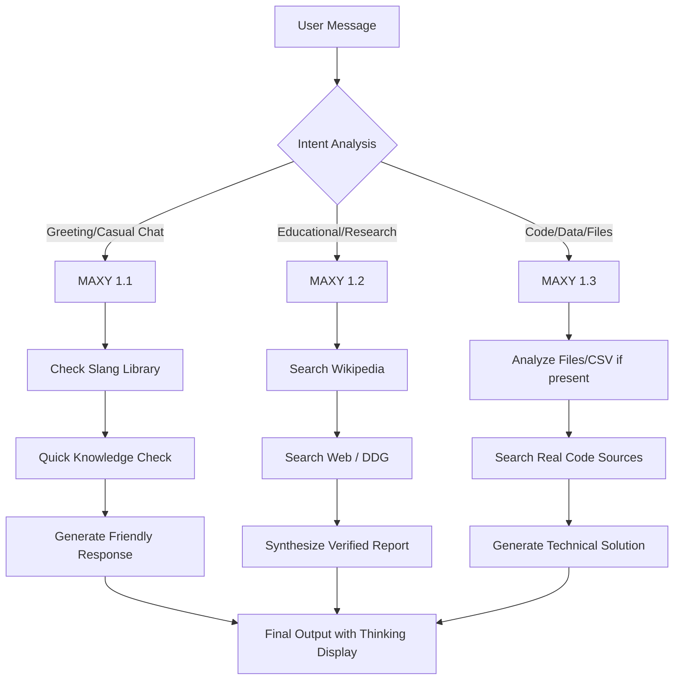

# 🤖 Welcome to MAXY: Your Multi-Model AI Companion

Welcome to the official documentation for **MAXY Chat**! We’ve designed MAXY to be more than just a chatbot; it’s a tiered intelligence system that adapts to your specific needs—whether you're looking for a quick friendly chat, deep academic research, or complex technical problem-solving.

---

## 📖 Table of Contents
1. [The MAXY Philosophy](#-the-maxy-philosophy)
2. [Meet the Models](#-meet-the-models)
3. [Under the Hood: How MAXY Thinks](#-under-the-hood-how-maxy-thinks)
4. [MAXY in Real Life](#-maxy-in-real-life)
5. [Getting Started & Tech Stack](#-getting-started--tech-stack)

---

## ✨ The MAXY Philosophy
We believe that one size doesn't fit all when it comes to AI. Sometimes you need a friend who understands local slang (**MAXY 1.1**), sometimes you need a librarian who can cross-reference global knowledge (**MAXY 1.2**), and sometimes you need a senior engineer who can build and analyze entire systems (**MAXY 1.3**). 

MAXY is built on transparency—you don't just get an answer; you get to see the **Thinking Process** behind it.

---

## 🧠 Meet the Models

### 🌈 MAXY 1.1: The Conversational Socialite
*   **Personality**: Friendly, fast, and culturally aware.
*   **Specialty**: Daily assistance, quick questions, and local flavor.
*   **Key Feature**: **Multi-lingual Slang Support**. MAXY 1.1 understands and uses local dialects (like Bangalore slang) to make conversations feel like you're talking to a neighbor.

### 📚 MAXY 1.2: The Research Maven
*   **Personality**: Professional, thorough, and fact-focused.
*   **Specialty**: Academic support, verifying news, and deep-dive learning.
*   **Key Feature**: **Knowledge Synthesis**. 1.2 doesn't just guess; it cross-references Wikipedia and Real-time Search to provide verified reports with sources.

### 💻 MAXY 1.3: The Technical Architect
*   **Personality**: Logical, precise, and highly capable.
*   **Specialty**: Coding, Data analysis, and File intelligence.
*   **Key Feature**: **Dynamic Synthesis**. It can "look" at your documents, analyze your CSV data for trends, and write production-ready code on the fly.

---

## ⚙️ Under the Hood: How MAXY Thinks

When you send a message, MAXY goes through a sophisticated routing and synthesis process to make sure you get the best result.

---

## 🌍 MAXY in Real Life

What can you actually *do* with MAXY? Here are some real-world scenarios:

### 1. The Student's Shortcut 🎓
> **Scenario**: "Explain the French Revolution in 5 minutes."
> **MAXY Logic**: Trigger **1.2**. It scans historical records and gives you a structured overview with key dates and impacts, verified for accuracy.

### 2. The Developer's Partner 👨‍💻
> **Scenario**: "I have a bug in my Python decorator, and I need a Bubble Sort implementation."
> **MAXY Logic**: Trigger **1.3**. It researches the specific technical pattern, writes the code, and explains the logic step-by-step.

### 3. The Local Vibe ☕
> **Scenario**: "Yen guru, how's the weather today?"
> **MAXY Logic**: Trigger **1.1**. It recognizes the Bangalore slang, responds with a matching vibe, and provides a quick weather update.

### 4. The Business Analyst 📊
> **Scenario**: "Analyze this Sales.csv and tell me the trends."
> **MAXY Logic**: Trigger **1.3**. It parses the file, calculates standard deviation, identifies outliers, and even generates a chart for you.

---

## 🛠️ Getting Started & Tech Stack

MAXY is built using a modern, efficient tech stack designed for speed and reliability:

- **Backend**: Python with **FastAPI** for high-performance API routing.
- **Frontend**: Clean **HTML/CSS/JS** with a focus on premium aesthetics.
- **Data Persistence**: **Supabase** for secure user authentication and data management.
- **Intelligence Engines**: Custom logic layers for Wikipedia, DuckDuckGo, and Statistical Analysis.
